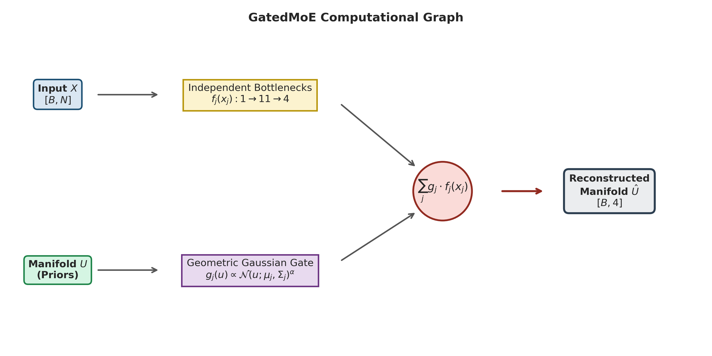

# GAMoE: Geometry-Aware Mixture of Experts for Neural Manifold Composition

[](https://colab.research.google.com/github/PridaLab/gamoe_model/notebooks/gamoe_simulated_example.ipynb)
[](https://www.python.org/downloads/)
[](https://pytorch.org/)
[](https://opensource.org/licenses/MIT)

A modular PyTorch implementation of **Geometry-Aware Mixture of Experts (GAMoE)** for mapping cell-type-specific neural activity (firing rates or synaptic weights) onto low-dimensional functional manifold geometries (UMAP or Frequency-Amplitude-Entropy space) under systematic cell-type and laminar ablation paradigms.

---

## 🔬 Model Overview

GAMoE decomposes population neural dynamics by allocating an independent, constrained bottleneck expert network $f_j(x_j)$ to each neuronal subpopulation (e.g., deep/superficial pyramidal cells and diverse interneuron subtypes). Experts are dynamically recombined using a geometry-aware gating function $g_j(u)$ derived from Gaussian density priors fitted over the underlying manifold coordinates.

<p align="center">
  
</p>

$$\hat{U} = \sum_{j=1}^{N} g_j(U) \cdot f_j(x_j)$$

where $g_j(U) \propto \mathcal{N}(U; \mu_j, \Sigma_j)^\alpha$ and $\sum_j g_j(U) = 1$.

---

## 📊 Key Analytical Features

### 1. Spatial Structure Index (SI)
Quantifies whether raw feature activations, gating probabilities, or prediction errors exhibit localized topological organization across the latent manifold.


### 2. Dual-Mode Systematic Ablations
The framework benchmarks network degradation using complementary ablation modalities:
* **Gate Masking (`gate`)**: Sets $g_j = 0$ for targeted subpopulations and renormalizes remaining gates to evaluate functional necessity.
* **Gate Shuffling (`shuffle`)**: Randomly permutes $g_j$ across samples to evaluate dependency on manifold geometry while preserving marginal activation distributions.
* **Input Zeroing (`input`)**: Directly masks standardized inputs $x_j = 0$.

### 3. Spatial Residual Error Maps
Identifies local coordinate patches of the manifold that degrade when specific cell assemblies or cortical depths are perturbed.


---
## 📁 Repository Structure

```text
gamoe_model/
├── configs/
│   └── ablation_config.py      # Feature sets, cell-type pairs, ablation conditions
├── src/
│   ├── models/
│   │   ├── moe.py              # ExpertLinearProj, GatedMoE architectures
│   │   └── knn.py              # KNN baseline wrapper (drop & shuffle)
│   ├── geometry/
│   │   ├── prior.py            # Gaussian prior & gate builders
│   │   └── structure_index.py  # Structure Index (SI) computation
│   ├── stats/
│   │   ├── parametric.py       # One-way/Two-way ANOVA + Bonferroni post-hoc
│   │   └── non_parametric.py   # Kruskal-Wallis + pairwise Mann-Whitney U
│   └── utils/
│       ├── data_loaders.py     # CSV/MAT loaders, covariate aligners
│       └── metrics.py          # Variance-weighted R², RMSE, error-weighted means
├── experiments/
│   ├── run_gamoe_kfold.py      # K-fold GAMoE training and inference
│   └── run_knn_kfold.py        # K-fold KNN ablation & shuffle training
├── analysis/
│   ├── compute_statistics.py   # Statistical testing on saved CSV outputs
│   └── compute_si_metrics.py   # Structure Index evaluation on latent predictions
├── visualization/
│   ├── plot_performance.py     # R² and Euclidean error plots
│   ├── plot_latent_maps.py     # UMAP scatter, error projections, overlays
│   └── plot_covariates.py      # Error-weighted freq/amp/entropy summaries
├── notebooks/
│   └── gamoe_simulated_example.ipynb # Interactive demo with simulated data
├── docs/
│   └── images/                 # Embedded README figures
└── requirements.txt
