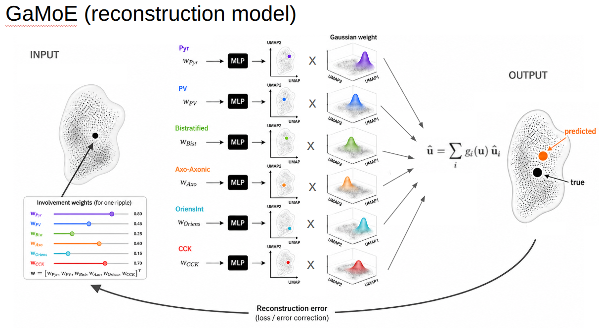

# GAMoE: Geometry-Aware Mixture of Experts (GaMoE) for cell-type-specific factorization of hippocampal ripples

[](https://colab.research.google.com/github/PridaLab/gamoe_model/blob/main/notebooks/gamoe_simulated_example.ipynb)
[](https://www.python.org/downloads/)
[](https://pytorch.org/)
[](https://opensource.org/licenses/MIT)

GaMoE provides a framework for factorizing how distinct input sources contribute across the geometry of a complex data space. Here, we apply GaMoE to hippocampal ripples, using cell-type-resolved population activity as experts to evaluate their contribution to their variability. The framework is general and can be adapted to other datasets in which heterogeneous input sources contribute differentially across a structured output space. We first introduce the general method using a synthetic dataset [here], and then apply GaMoE to factorize cell-type contributions to hippocampal ripple variability [here].

---

## 🔬 Model Overview

GAMoE factorizes complex high-dimensional systems by allocating an independent, constrained bottleneck expert network $f_j(x_j)$ ($1 \to H \to \text{ReLU} \to D$) to each input dimension or functional channel $x_j$. 

Instead of learning unconstrained gating from raw inputs, experts are dynamically recombined using a **geometry-aware gating function** $g_j(\mathbf{u})$ derived from spatial density priors over the target data coordinates:
$$\hat{\mathbf{u}}_i = \sum_{j=1}^{N} g_j(\mathbf{u}_i) \cdot f_j(x_{ij})$$

where the gating distribution is normalized across all $N$ experts:

$$g_j(\mathbf{u}) \propto \mathcal{N}(\mathbf{u}; \boldsymbol{\mu}_j, \boldsymbol{\Sigma}_j)^\alpha, \qquad \sum_{j=1}^{N} g_j(\mathbf{u}) = 1$$

In the hippocampal application shown below, individual ripples are represented by their waveforms and embedded into a low-dimensional space using UMAP. Cell-type-specific activity then provides the inputs to the GaMoE experts.

<p align="center">
  
</p>
---

## 🧪 Systematic Component Ablation Simulations

To assess how individual inputs or functional modules contribute to data reconstruction, ablations are executed **strictly at test time**, keeping the trained expert parameters fixed. GAMoE tests three distinct perturbation mechanisms:

### 1. Gate Drop / Component Masking (`gate`)
Completely isolates and disables an expert or subset of experts $\mathcal{A} \subset \{1, \dots, N\}$ by zeroing their gating coefficients and renormalizing the remaining active pathways:

$$g'_{ij} = \begin{cases}  0, & \text{if } j \in \mathcal{A} \\ \frac{g_{ij}}{\sum_{k \notin \mathcal{A}} g_{ik}}, & \text{otherwise} \end{cases}$$

This test measures the absolute necessity of the ablated components for reconstructing the manifold trajectory.

### 2. Gate Shuffling (`shuffle`)
Randomly permutes the gating values of selected experts across all events, $\{g_{ij}\}_i$, while keeping other gates untouched:

$$g'_{ij} = \text{permute}(\{g_{ij}\}_i), \qquad g''_{ij} = \frac{g'_{ij}}{\sum_{k=1}^N g'_{ik}}$$

This preserves each expert's overall marginal activation distribution while abolishing its spatial alignment with the manifold coordinates. It isolates whether the model depends on **geometry-specific routing** or simply on unaligned capacity.

### 3. Input Feature Masking (`input`)
Directly clamps standardized input channels to zero ($x_{ij} = 0$) while preserving the geometric gating priors.

---

## ⚖️ Benchmark & Control Models

To verify that manifold reconstruction depends on geometric alignment rather than raw parameter capacity, GAMoE benchmarks against:

* **Agnostic MoE ($\mathbf{aMoE}$)**: Evaluates trained experts under globally permuted gates across all samples, destroying manifold coordination while preserving marginal gating statistics.
* **Feature-Space MoE ($\mathbf{fMoE}$)**: Reconstructs auxiliary continuous system variables directly from weighted inputs.
* **$k$-Nearest-Neighbors Regressor ($\mathbf{KNN}$)**: Direct non-parametric baseline predicting manifold coordinates from raw inputs without modular bottlenecking or geometric priors. Parallel feature-drop and feature-shuffle ablations are performed at the input layer.

---

## 📈 Error-Weighted Manifold State Variables

To evaluate how localized reconstruction errors correlate with continuous system states (e.g., speed, energy, frequency, or order parameters $s_k$), we calculate error-weighted state averages across test events:

$$\langle s \rangle_e = \frac{\sum_i e_i \cdot s_i}{\sum_i e_i}$$

where $e_i = \Vert{}\hat{\mathbf{u}}_i - \mathbf{u}_i\Vert{}_2$ is the sample-wise Euclidean reconstruction error in the latent space. Samples with larger reconstruction failures contribute more heavily, pinpointing which state regimes degrade during specific component dropouts.

---

## 🎯 Quantitative Evaluation Metrics

All models are evaluated via **$K$-fold cross-validation** across the following metrics:

1. **Per-Dimension $R^2$**: Squared Pearson correlation between true and predicted manifold coordinates along each latent dimension $d \in \{1, \dots, D\}$:
   $$R^2_d = \left( \frac{\text{Cov}(\mathbf{u}_d, \hat{\mathbf{u}}_d)}{\sigma_{\mathbf{u}_d} \sigma_{\hat{\mathbf{u}}_d}} \right)^2$$
2. **Global Variance-Weighted $R^2$**: Overall score weighting each dimension by its true variance:
   $$R^2_{\text{global}} = \sum_{d=1}^{D} w_d R^2_d, \quad \text{where } w_d = \frac{\text{Var}(\mathbf{u}_d)}{\sum_{k=1}^D \text{Var}(\mathbf{u}_k)}$$
3. **Point-wise Euclidean Error**: Residual manifold displacement $e_i = \Vert{}\hat{\mathbf{u}}_i - \mathbf{u}_i\Vert{}_2$.
4. **Topological Structure Index (SI)**: Quantifies whether continuous features, gating probabilities, or residual errors exhibit non-random clustering along the manifold surface.

<p align="center">
  
</p>

---

## 📁 Repository Structure

```text
gamoe_model/
├── configs/
│   └── ablation_config.py      # Feature definitions, module groupings, ablation conditions
├── src/
│   ├── models/
│   │   ├── moe.py              # ExpertLinearProj, GatedMoE architectures
│   │   └── knn.py              # KNN baseline models (feature drop & shuffle)
│   ├── geometry/
│   │   ├── prior.py            # Gaussian density prior & gate computation
│   │   └── structure_index.py  # Structure Index (SI) graph routines
│   ├── stats/
│   │   ├── parametric.py       # One-way/Two-way ANOVA + Bonferroni post-hoc
│   │   └── non_parametric.py   # Kruskal-Wallis + pairwise Mann-Whitney U tests
│   └── utils/
│       ├── data_loaders.py     # Generic dataset readers & covariate aligners
│       └── metrics.py          # Variance-weighted R², RMSE, error weighting
├── experiments/
│   ├── run_gamoe_kfold.py      # K-fold training and dual-mode ablation pipeline
│   └── run_knn_kfold.py        # K-fold KNN regression baseline benchmark
├── analysis/
│   ├── compute_statistics.py   # Automated parametric & non-parametric statistical reports
│   └── compute_si_metrics.py   # Post-hoc Structure Index processing
├── visualization/
│   ├── plot_performance.py     # Global R² and error boxplots
│   ├── plot_latent_maps.py     # Manifold overlays and residual error heatmaps
│   └── plot_covariates.py      # State variable summaries across conditions
├── notebooks/
│   └── gamoe_simulated_example.ipynb # Interactive tutorial with synthetic data
├── docs/
│   └── images/                 # Architecture schematics & figures
└── requirements.txt
```
---
## Citation

If you use this codebase or model in your research, please cite:

```bibtex
@software{gamoe_model2026,
  author = {Teresa Jurado-Parras#, Melisa Maidana-Capitan#, Candela Sanchez-Bellot*, Eloy Parra-Barrero*, Elena Cid, Enrique R. Sebastian, and Liset M. de la Prida},
  title = {Cell-type-resolved microcircuit dissection reveals inhibitory modules underlying ripple variability},
  url = {[https://github.com/PridaLab/gamoe_model](https://github.com/PridaLab/gamoe_model)},
  year = {2026}
}
```
---
## Running steps

# 1. Train GAMoE across gate-masking and gate-shuffling
python -m experiments.run_gamoe_kfold

# 2. Train KNN across feature-drop and column-shuffling
python -m experiments.run_knn_kfold

# 3. Run complete statistical testing (ANOVA, KW, MWU, paired t-tests)
python -m analysis.compute_statistics

# 4. Generate all figures
python -m visualization.plot_performance
python -m visualization.plot_latent_maps
python -m visualization.plot_covariates

---
## Licence 

